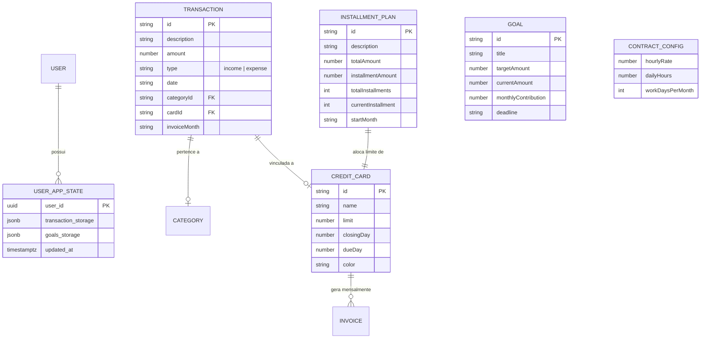

# Swift Finances (v2.0) — Sistema de Gestão e Previsibilidade Financeira

[](https://react.dev/)
[](https://www.typescriptlang.org/)
[](https://vitejs.dev/)
[](https://tailwindcss.com/)
[](https://github.com/pmndrs/zustand)
[-brightgreen?logo=vitest&logoColor=white)](https://vitest.dev/)
[](https://devfinances-jvsz.netlify.app/)
[](LICENSE)

> **Projeto Prático de Engenharia de Software**  
> Aplicação Client-Side Local-First desenvolvida iterativamente ao longo do curso de graduação em Engenharia de Software, focada em previsibilidade orçamentária, baixo atrito cognitivo e mitigação de ansiedade financeira.

---

## 1. Visão Geral do Sistema

O **Swift Finances** é um ecossistema de inteligência orçamentária pessoal e profissional (PJ/Freelancer). Ele supera as limitações de ferramentas tradicionais de "livro-caixa" ao transformar dados passados em **motores de projeção prospectiva**, permitindo ao usuário antecipar seu fluxo de caixa para os próximos meses com rigor matemático.

### Pilares Arquiteturais:
* **Deploy Contínuo em Produção (Netlify):** Pipeline de CI/CD automática conectada ao repositório, com minificação e entrega global via CDN Edge.
* **Arquitetura Local-First:** Os dados residem prioritariamente no dispositivo do usuário com persistência reativa, assegurando total privacidade, velocidade instantânea e tolerância a falhas de rede.
* **Sincronização em Nuvem Híbrida (Supabase):** Camada de replicação com Row Level Security (RLS) e transações atômicas seguras via PL/pgSQL no PostgreSQL.
* **Calm Developer UX:** Design system ergonômico com Tailwind CSS, paleta de baixo estresse visual (`zinc`, `emerald`, `rose`, `indigo`), suporte a Dark/Light Mode e visualizações analíticas de alta densidade via Apache ECharts.
* **Domínio Financeiro Desacoplado:** Regras de negócio críticas (cálculo de faturas operacionais, juros, amortização iterativa de parcelas e projeções de fluxo de caixa) são modeladas em funções puras, isoladas da renderização e 100% cobertas por testes automatizados.

---

## 2. Arquitetura do Software

A aplicação adota separação estrita de responsabilidades inspirada em Domain-Driven Design (DDD) e Clean Architecture adaptada para SPAs modernas em React.

<p align="center">
  
</p>

---

## 3. Modelo de Dados e Entidades (DER)

A persistência em nuvem e a modelagem do domínio TypeScript refletem a estrutura relacional e de documentos abaixo:

<p align="center">
  
</p>



---

## 4. Regras de Negócio Críticas Implementadas

1. **Separação de Ciclo Operacional vs. Vencimento Financeiro de Cartão:**
   A compra no crédito consome o limite do cartão em tempo real (`creditLimit - totalCommitted`), porém seu desembolso financeiro é alocado no fluxo de caixa unicamente no mês de vencimento da fatura correspondente.
2. **Motor Iterativo de Parcelas:**
   Parcelamentos (`InstallmentPlan`) avançam progressivamente (ex: `1/5 -> 2/5 -> 5/5`) e são removidos deterministicamente das projeções de custos quando totalmente amortizados.
3. **Cálculo de Sobra Líquida Projetada:**
   $$\text{Sobra Líquida} = \text{Receita PJ Projetada} - \text{Custos Fixos} - \text{Faturas e Parcelas do Mês Alvo}$$
4. **Regra do Mês Cheio em Metas Financeiras:**
   Calculado rigorosamente através de `Math.ceil((Alvo - Guardado) / AporteMensal)`, evitando frações enganosas de meses para o atingimento de reservas e metas.
5. **Detector de Sobrecarga Orçamentária:**
   Cruzamento automático entre a soma dos aportes planejados e a sobra líquida projetada do fluxo de caixa, disparando alertas visuais preventivos quando há comprometimento excessivo.
6. **Integração Dinâmica com BrasilAPI para Faturamento PJ:**
   Algoritmo que desconta feriados nacionais em dias úteis para apuração precisa da receita bruta mensal estimada (`diasÚteis * horasDia * valorHora`).

---

## 5. Qualidade de Software e Testes Automatizados

O projeto conta com garantia contínua de qualidade por meio de testes unitários com **Vitest** e tipagem estrita de ponta a ponta com TypeScript e Zod.

```bash
$ npm test

 ✓ src/data/banks.test.ts (3 tests)
 ✓ src/utils/domain/monthly-payments.test.ts (5 tests)
 ✓ src/utils/weekly-expenses.test.ts (13 tests)
 ✓ src/utils/domain/creditCards.test.ts (11 tests)
 ✓ src/utils/projections.test.ts (22 tests)
 ✓ src/modules/commerce/store/useCommerceStore.test.ts (2 tests)
 ✓ src/store/useTransactionStore.test.ts (13 tests)
 ✓ src/services/supabase-sync.test.ts (1 test)
 ✓ src/schemas/forms.test.ts (5 tests)
 ✓ src/modules/commerce/utils/calculate-pricing.test.ts (3 tests)
 ✓ src/utils/featureAccess.test.ts (2 tests)
 ✓ src/utils/domain/transactions.test.ts (2 tests)

 Test Files  12 passed (12)
      Tests  82 passed (82)
   Duration  2.35s
```

---

## 6. Como Executar Localmente

### Pré-requisitos
* Node.js (versão 18 ou superior)
* Gerenciador de pacotes `npm`

### Instalação e Execução

```bash
# 1. Clonar o repositório
git clone https://github.com/joaovsz/devFinancesReact.git
cd devFinancesReact

# 2. Instalar dependências
npm install

# 3. Executar em ambiente de desenvolvimento
npm run dev

# 4. Executar os testes automatizados
npm test

# 5. Gerar build de produção otimizada
npm run build

# 6. Visualizar a build gerada
npm run preview
```

---

## 7. Rastreabilidade de Engenharia de Software

Este repositório possui documentação completa do ciclo de vida:

| Artefato | Arquivo | Finalidade |
| :--- | :--- | :--- |
| **Especificação de Requisitos** | [`Requisitos Sistema Financeiro (2).md`](./Requisitos%20Sistema%20Financeiro%20(2).md) | Requisitos funcionais (RF) e não funcionais (RNF). |
| **Backlog Ágil e Sprints** | [`BACKLOG_V2.md`](./BACKLOG_V2.md) | Sprints 0 a 4, Épicos, User Stories e Critérios de Aceitação. |
| **Memorial Descritivo Oficial** | [`docs/MEMORIAL_DESCRITIVO_ATIVIDADES.md`](./docs/MEMORIAL_DESCRITIVO_ATIVIDADES.md) | Documento institucional de validação de horas e declaração de autoria. |
| **Plano de Ação & Roteiro de Vídeo** | [`docs/PLANO_DE_ACAO_HORAS_COMPLEMENTARES.md`](./docs/PLANO_DE_ACAO_HORAS_COMPLEMENTARES.md) | Estratégia de defesa técnica, checklist e roteiro minuto a minuto. |
| **Diagramas de Arquitetura & DER** | [`docs/diagrams/`](./docs/diagrams/) | Diagramas vetoriais SVG de arquitetura e entidade-relacionamento. |
| **Plano de Modernização** | [`PLANO_ACAO_MODERNIZACAO_FINANCEIRA.md`](./PLANO_ACAO_MODERNIZACAO_FINANCEIRA.md) | Decisões arquiteturais, refatoração de domínio e migração. |
| **Histórico Versionado** | `git log` (110 commits) | Rastreabilidade cronológica de 2022 a 2026. |
| **Schema e Segurança** | [`supabase-schema.sql`](./supabase-schema.sql) | DDL PostgreSQL, Stored Procedures e Políticas RLS. |
| **Massa de Dados Fictícia** | [`demo-data.json`](./demo-data.json) | Backup JSON para apresentação e demonstração no localStorage. |

