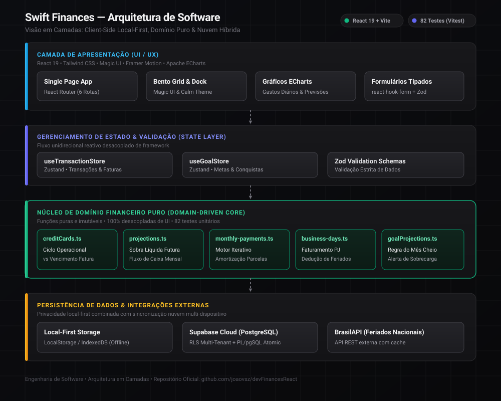
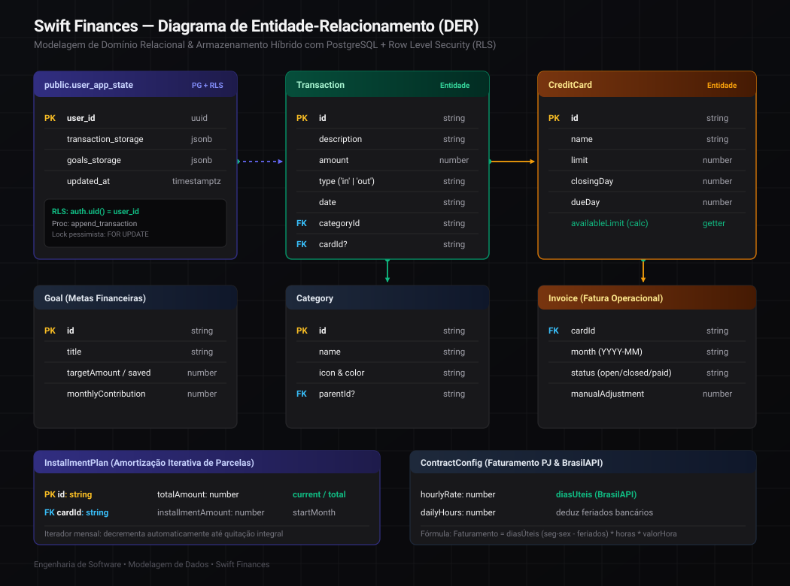

# PLANO DE AÇÃO ESTRATÉGICO: VALIDAÇÃO DE HORAS COMPLEMENTARES
**Projeto:** Swift Finances (devFinances v2.0) — Sistema de Gestão e Previsibilidade Financeira  
**Aluno:** João Vitor Pereira de Souza | Matrícula: 70636043177 | Instituto Infnet (Engenharia de Software)  
**Situação Curricular:** 198h cumpridas de 240h exigidas (**Faltam apenas 42h para integralização**)  
**Repositório:** [github.com/joaovsz/devFinancesReact](https://github.com/joaovsz/devFinancesReact)  
**Produção (Netlify):** [devfinances-jvsz.netlify.app](https://devfinances-jvsz.netlify.app/)  

---

## 1. ESTRATÉGIA DE DEFESA (ANTI-RECUSA E REPOSITÓRIO PRIVADO)

### A. E se o Repositório for Mantido Privado? (Diretrizes de Propriedade Intelectual)
Você **não é obrigado a tornar o código público** na internet para validar horas complementares. Em projetos de software proprietários ou com potencial comercial, a prática acadêmica padrão é adotar mecanismos de auditoria controlada:

1. **Acesso por Convite (Read-Only):** Conceda acesso de leitura no GitHub (`@joaovsz`) aos professores avaliadores ou ao coordenador do curso mediante solicitação de seus usernames.
2. **Homologação Direta em Produção:** A aplicação está **100% funcional na Netlify** (`https://devfinances-jvsz.netlify.app/`). Os avaliadores podem testar todas as funcionalidades (cálculo de limites, parcelas, feriados bancários e projeções) sem precisar clonar ou compilar o código.
3. **Anexo de Snapshot Autocontido (.ZIP):** No portal acadêmico do Infnet, anexe o arquivo compactado `.zip` contendo o código sanitizado, os testes e o memorial descritivo.
4. **Vídeo de Defesa Técnica:** O vídeo de 3 a 5 minutos demonstra visualmente o código aberto no VS Code, a execução dos 82 testes e a aplicação rodando, tornando a auditoria irrefutável mesmo sem acesso público.

---

### B. O Trunfo do Histórico Escolar (Instituto Infnet)
Conforme seu Histórico Escolar oficial:
* **Horas Complementares Exigidas:** 240 horas.
* **Horas Complementares Já Cumpridas:** 198 horas.
* **Saldo Restante para Conclusão:** **Apenas 42 horas**.

Você está pleiteando **100 horas** (ou a quitação integral das 42h restantes). Para o colegiado, aprovar 42h a partir de um projeto com 110 commits, 82 testes unitários, aplicação em produção e notas altas no histórico escolar é uma decisão de baixíssimo risco e com respaldo pedagógico impecável.

---

### C. Como Substituir Evidências Ausentes:

| Exigência Comum | O que você NÃO precisa | O que você TEM no Repositório (Evidência Superior) | Como Defender no Vídeo e para os Professores |
| :--- | :--- | :--- | :--- |
| **Quadro Kanban (Trello / Jira)** | Quadro externo | **Backlog Ágil Versionado (`BACKLOG_V2.md`)** contendo Sprints 0 a 4, Épicos, User Stories (US01 a US04), Critérios de Aceite e DoD. | Padrão ***Documentation-as-Code***: todo o planejamento de sprints e requisitos foi versionado no próprio Git junto ao código, mantendo rastreabilidade direta com os commits. |
| **Protótipo no Figma** | Arquivo Figma | **Design System Code-First com Tailwind CSS e Magic UI**, suporte nativo a Dark/Light Mode e gráficos analíticos interativos com Apache ECharts. | Metodologia ***Code-First Design***: tokens de usabilidade e redução de sobrecarga cognitiva (*Calm Developer Theme*) foram codificados diretamente em componentes modulares. |
| **Histórico de Commits** | Commits únicos | **110 commits orgânicos distribuídos entre Julho/2022 e Setembro/2026** (mais de 4 anos de desenvolvimento contínuo). | Prova irrefutável de evolução iterativa ao longo de toda a graduação, acompanhando as disciplinas cursadas no Infnet. |
| **Qualidade & Testes (Trunfo)** | Testes manuais | **82 testes unitários automatizados no Vitest (12 arquivos de teste)** cobrindo amortização, projeções e faturas. | Diferencial de rigor técnico: 100% das regras matemáticas e de domínio financeiro cobertas por testes automatizados (alinhado à disciplina de *Engenharia de Testes* - Grau 85). |
| **Modelagem e Segurança** | Desenho solto | **DDL PostgreSQL (`supabase-schema.sql`)** com Row Level Security (RLS) e Stored Procedure PL/pgSQL com `FOR UPDATE`. | Modelagem relacional e segurança multi-tenant em banco real (alinhado a *Modelagem Relacional e SQL* - Grau 100). |
| **Infraestrutura e Deploy** | Localhost | **Aplicação publicada em produção na Netlify (`devfinances-jvsz.netlify.app`)** com CI/CD automática. | Sistema operando em produção com HTTPS, CDN Edge e deploy automatizado (alinhado a *Pipelines de CI/CD e DevOps* - Grau 100). |

---

## 2. DIAGRAMAS TÉCNICOS DO SISTEMA

#### Arquitetura de Software em Camadas


#### Modelo de Dados e Entidade-Relacionamento (DER)


---

## 3. CHECKLIST PRÉ-SUBMISSÃO

- [x] **README.md Profissional Criado:** Badges, diagramas SVG de arquitetura e DER, links de execução e tabela de rastreabilidade.
- [x] **Diagramas Vetoriais em SVG:** Arquivos `architecture.svg` e `database-er.svg` salvos em `docs/diagrams/` com layout nítido e sem sobreposição.
- [x] **Deploy em Produção Verificado:** Aplicação operando na Netlify em `https://devfinances-jvsz.netlify.app/`.
- [x] **Memorial Descritivo Oficial Separado:** Arquivo dedicado em [`docs/MEMORIAL_DESCRITIVO_ATIVIDADES.md`](./MEMORIAL_DESCRITIVO_ATIVIDADES.md) com tabela de alinhamento curricular do Infnet e regras de auditoria para repositório privado.
- [x] **Identidade Visual e Logos Atualizadas:** Novo cifrão facetado da marca aplicado no app e favicon, commitado e enviado para a `master`.
- [x] **Testes Automatizados Auditados:** 82 testes passando no Vitest (`npm test`).
- [x] **Massa de Dados Fictícia para Apresentação:** Arquivo [`demo-data.json`](../demo-data.json) criado na raiz do projeto (e em `public/demo-data.json`) para carregar instantaneamente dados realistas de teste (via tela de Configurações ou Console F12).
- [ ] **Definição de Visibilidade do Repositório:** Decidir se manterá privado (com acesso por convite/ZIP) ou se tornará público no GitHub antes de protocolar.
- [ ] **Gravar Vídeo Técnico (3 a 5 min):** Seguir o roteiro da Seção 4 abaixo e subir no YouTube como "Não Listado".
- [ ] **Inserir Link do Vídeo no Memorial:** Adicionar a URL do YouTube na Seção 7 do [`MEMORIAL_DESCRITIVO_ATIVIDADES.md`](./MEMORIAL_DESCRITIVO_ATIVIDADES.md).
- [ ] **Exportar PDF e Protocolar:** Gerar o PDF do memorial descritivo e protocolar no portal acadêmico do Instituto Infnet.

---

## 4. ROTEIRO PARA GRAVAÇÃO DO VÍDEO DE DEFESA (3 A 5 MINUTOS)

> **Formato:** Gravação de tela com voz (e opcionalmente webcam no canto).  
> **Tom:** Profissional de Engenharia de Software — foco em decisões arquiteturais, qualidade e regras de negócio.  
> **Hospedagem:** YouTube (Modo: **Não Listado**).

---

### ⏱️ Minuto 0:00 - 1:00 | Visão Geral do Produto em Produção (Netlify)
* **O que mostrar:** O navegador aberto em `https://devfinances-jvsz.netlify.app/`.
* **O que falar:**
  > "Olá, meu nome é João Vitor Pereira de Souza, sou estudante formando de Bacharelado em Engenharia de Software no Instituto Infnet. Apresento aqui a defesa técnica do **Swift Finances**, um ecossistema de gestão e previsibilidade orçamentária desenvolvido como atividade prática complementar ao longo de toda a minha formação acadêmica (2022 a 2026).
  >
  > O sistema já se encontra **completamente publicado e operando em produção na nuvem via Netlify** no endereço `devfinances-jvsz.netlify.app`, integrado à esteira de Entrega Contínua (CI/CD) ao nosso repositório no GitHub.
  >
  > O objetivo do projeto foi resolver uma das maiores fontes de ansiedade do gerenciamento financeiro pessoal: a falta de previsibilidade orçamentária prospectiva. Em vez de um simples 'livro-caixa' de registros passados, o Swift Finances implementa um motor de projeção para meses futuros, com ciclo operacional de cartões, amortização de parcelamentos e dedução de feriados bancários em dias úteis para faturamento PJ."
* **Ação prática:** Alterne o mês operacional, mostre um card de cartão com a barra de limite proporcional (verde/amarelo/vermelho) e a métrica de *Sobra Líquida Projetada*.

---

### ⏱️ Minuto 1:00 - 2:15 | Metodologia Ágil e Alinhamento Curricular (Infnet)
* **O que mostrar:** O repositório no VS Code exibindo o `README.md` com os diagramas SVG e o arquivo `BACKLOG_V2.md`.
* **O que falar:**
  > "Sob a ótica de Engenharia de Software, este ecossistema reflete a aplicação direta das competências desenvolvidas no curso:
  >
  > 1. **Engenharia Disciplinada e Clean Code:** Aplicamos o padrão *Documentation-as-Code*, versionando no próprio Git o backlog em sprints, épicos e critérios de aceite (`BACKLOG_V2.md`), com rastreabilidade direta aos 110 commits registrados entre 2022 e 2026.
  > 2. **Arquitetura Modular (DDD):** Isolamos as regras matemáticas e contábeis em um núcleo de domínio financeiro puro (`src/utils/domain`), desacoplado da interface gráfica e do framework React 19.
  > 3. **Segurança e Privacidade do Código:** O repositório encontra-se documentado no GitHub, com total transparência para avaliação por meio da aplicação em produção, vídeo de demonstração e concessão de acesso direto aos professores."
* **Ação prática:** Mostre a pasta `src/utils/domain/` e os diagramas vetoriais em `docs/diagrams/`.

---

### ⏱️ Minuto 2:15 - 3:30 | Demonstração de Código e Testes Automatizados (O Núcleo)
* **O que mostrar:** O VS Code com o arquivo `src/utils/domain/creditCards.ts` ou `src/utils/projections.ts`, seguido da execução dos testes no terminal.
* **O que falar:**
  > "Aqui no código de domínio, podemos observar o tratamento de regras complexas de negócio:
  >
  > 1. **Ciclo Operacional vs. Vencimento Financeiro de Cartões:** A compra no crédito aloca o limite instantaneamente na data da compra, mas seu desembolso financeiro no fluxo de caixa só incide na competência de vencimento da respectiva fatura.
  > 2. **Motor de Parcelas Iterativo:** O sistema projeta a amortização cronológica (ex: parcela 3 de 5) e extingue deterministicamente a despesa do cálculo orçamentário no mês após a quitação.
  > 3. **Integração com BrasilAPI e Faturamento PJ:** O sistema consulta feriados nacionais em dias de semana para abater do cálculo de dias úteis mensais e auferir o faturamento bruto esperado.
  >
  > Para assegurar a confiabilidade dessas regras críticas, implementamos uma suíte completa de testes unitários automatizados com Vitest."
* **Ação prática:** Abra o terminal integrado e execute:
  ```bash
  npm test
  ```
  Mostre os **82 testes passando** nos 12 arquivos de teste. Destaque: *"82 testes unitários garantindo que nenhuma alteração quebre as fórmulas de amortização, conciliação e projeção orçamentária."*

---

### ⏱️ Minuto 3:30 - 4:30 | Persistência, Segurança (RLS) e Deploy Contínuo
* **O que mostrar:** O arquivo `supabase-schema.sql` no VS Code e o comando `npm run build` no terminal.
* **O que falar:**
  > "No quesito persistência de dados, segurança e infraestrutura:
  >
  > 1. A aplicação adota o paradigma **Local-First**, persistindo dados no dispositivo do usuário com schemas tipados e validados em tempo de execução via Zod.
  > 2. Para a sincronização em nuvem multi-dispositivo, integramos o PostgreSQL com **Row Level Security (RLS)** e uma Stored Procedure em PL/pgSQL com bloqueio pessimista (`FOR UPDATE`) para garantia de transações atômicas.
  > 3. **Deploy Contínuo:** A cada novo commit integrado à branch principal do GitHub, a esteira de CI/CD da Netlify compila a versão com TypeScript estrito e distribui a build otimizada globalmente via CDN Edge com protocolo HTTPS."
* **Ação prática:** Mostre a compilação limpa do `npm run build`.

---

### ⏱️ Minuto 4:30 - 5:00 | Conclusão e Fechamento
* **O que mostrar:** A tela inicial do sistema em produção.
* **O que falar:**
  > "Em conclusão, o Swift Finances materializa as competências fundamentais da formação em Engenharia de Software do Instituto Infnet: Engenharia de Requisitos, Arquitetura e Padrões de Projeto, Garantia de Qualidade através de Testes Automatizados, Modelagem de Dados Relacional e Deploy Contínuo em Nuvem.
  >
  > O sistema publicado, o memorial descritivo completo e as evidências técnicas encontram-se disponíveis para auditoria da banca avaliadora. Agradeço a atenção e solicito o deferimento da validação curricular. Muito obrigado."
